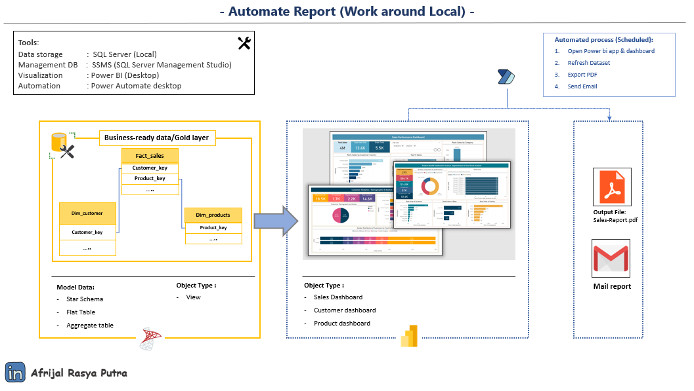

# 🧾 Power BI Report Automation (Local Desktop)

This project demonstrates a **local automation workflow** to generate and deliver business reports using:
- **SQL Server** for structured data storage
- **Power BI Desktop** for dashboard creation
- **Power Automate Desktop (PAD)** for automating PDF export and email delivery

> 💡 **Cloud Upgrade Available**  
This project is designed for local execution using Power BI Desktop and Power Automate Desktop.  
However, the entire workflow can be migrated to the **Power BI Service** and **Power Automate (Cloud)** environment with a **Power BI Pro account**, enabling:

- ✅ Scheduled report refresh via **Power BI Gateway**
- ✅ Automatic PDF export using **Power Automate (Cloud)**
- ✅ Cloud-based email delivery without local dependencies
---

## 🧭 Workflow Overview



---

## 📁 Project Structure

    ```plaintext
    automated-reporting-desktop-stack/
    │
    ├── data/                    # Sample data
    ├── docs/                     # Architecture diagram, process docs
    ├── automation/              # PAD flows, step-by-step
    ├── output/                  # Sample exported reports (PDF)
    ├── pbix/                 # Power BI Dashboard file (.pbix)
    ├── scripts/                 # SQL ETL or cleanup scripts
    ├── LICENSE
    ├── README.md


📄 License
This project is licensed under the MIT License. See the LICENSE file for details.


## 🌟 About me

Hi there! I am **Afrijal Rasya Putra**, an Informatics student who is interested in exploring the world of **Data Engineering & Analytics**. Although I am still at the beginning of my college journey, I am very enthusiastic about learning about how data is processed and transformed into meaningful information.

📌 I am currently studying:
- Data Visualization
- **SQL** and data manipulation basics
- Data Analytics
- Basic concepts of **ETL** and data pipeline workflow

I enjoy learning and exploring new things, especially those related to data. I am currently building my skills gradually and constantly looking for opportunities to grow. I am also open to **internships** or **collaborative projects** that can give me hands-on experience and help my learning process.

📫 Feel free to connect or discuss-I'd love to learn and grow together!

[](https://www.linkedin.com/in/afrijalrasyaputra/)
